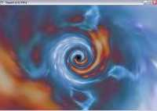



## Tunnel flight

### Description

Flight through tunnel. Example of TextureMapping in OpenGL.
 
### More Info
 

             |
---                |---
**Submitted On**   |2003-09-14 13:09:36
**By**             |[Jan Tosovsky](https://github.com/Planet-Source-Code/PSCIndex/blob/master/ByAuthor/jan-tosovsky.md)
**Level**          |Intermediate
**User Rating**    |5.0 (25 globes from 5 users)
**Compatibility**  |VB 5\.0, VB 6\.0
**Category**       |[Graphics](https://github.com/Planet-Source-Code/PSCIndex/blob/master/ByCategory/graphics__1-46.md)
**World**          |[Visual Basic](https://github.com/Planet-Source-Code/PSCIndex/blob/master/ByWorld/visual-basic.md)
**Archive File**   |[Tunnel\_fli16715711132003\.zip](https://github.com/Planet-Source-Code/jan-tosovsky-tunnel-flight__1-49881/archive/master.zip)

